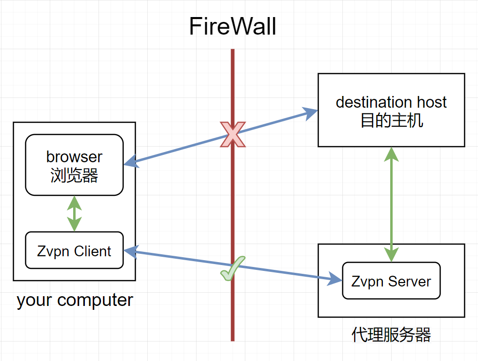
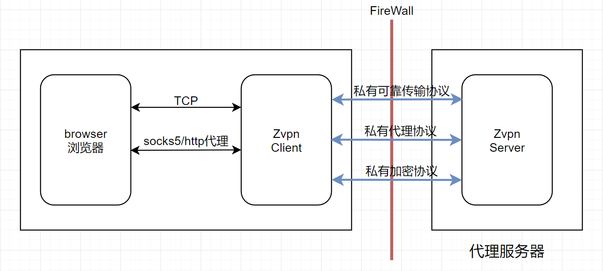

# Zvpn

假设有有一道防火墙阻挡了你和目的主机之间的网络连接，而存在另一台你能够访问的代理服务器A，A和目的主机之间能建立正常的网络连接，那么你就可以使用Zvpn来构建client和server分别部署在你的电脑和代理服务器上来实现流量的转发，让你能正常的访问目的主机。


<center>
    <div style="color:orange; display: inline-block;
    color: #999;
    padding: 2px;">其中一种情况，代理服务器在墙外</div>
</center>

在这种情况下，我们再假设这个防火墙会审查通过的流量，阻隔所有带有目的主机地址特征的数据包，为了突破防火墙，我们希望使用私有的传输、代理和加密协议。



为了减少重复的代码，Zvpn解耦出了三个模块，分别是可靠传输协议、代理协议和私有协议，分别对应Protocol、Proxy和Obfuscate三个interface

```go
type Conn interface {
	Write(buf []byte) (l int, err error)
	Read(buf []byte) (l int, err error)
	Close() error
}

type Listener interface {
	Accept() (Conn, error)
	Close() error
}

type Protocol interface {
	Bind(string) (Listener, error)
	Dial(string) (Conn, error)
}
```
```go
type Proxy interface {
	// return the Conn ready to forward data
	// 本地连接: 浏览器->本地服务器
	// 远程连接: 本地服务器->远程服务器
	// 传入一个本地连接和远程连接，返回一个完成代理握手的远程连接
	// 如果本地和远程的代理协议一样，那么直接return remote即可
	ClientHandshake(local, remote protocol.Conn, p protocol.Protocol) (protocol.Conn, error)
	// take a established Conn between client and server as argument
	// return the established Conn which is the client want to established
	// 传入一个已经完成可靠网络协议握手的conn，在这个conn上进行
	// 代理协议握手，并且返回一个按客户端要求在服务端上建立的连接
	ServerHandshake(protocol.Conn, protocol.Protocol) (protocol.Conn, error)
}
```
```go
type Obfuscate interface {
    // take a established conn between client and server as argument
	// 传入一个已经握手完毕的基于可靠传输协议的连接
	// 你可以在上面利用非对称加密交换密秘钥或者直接
	// 使用本地配置文件中的密钥
	ClientHandShake(protocol.Conn) (Encrypter, Decrypter, error)
	ServerHandShake(protocol.Conn) (Encrypter, Decrypter, error)
}

type Encrypter interface {
	Write(conn protocol.Conn, src []byte) (int, error)
}

type Decrypter interface {
	Read(conn protocol.Conn, dst []byte) (int, error)
}
```
你只需要自己实现这三个interface，并传入NewWallerCrosser中便可创建一个vpn实例。当然你也可以使用几个已经完成了的实现，Protocol可用的有TCP；Proxy可用的有Socks5；Obfuscate可用的有AES、RC4，加密协议均需要预先将秘钥储存在client和server本地。
```go
import (
	"github.com/ZerQAQ/Zvpn/obfus"
	"github.com/ZerQAQ/Zvpn/protocol"
	"github.com/ZerQAQ/Zvpn/proxy"
	"github.com/ZerQAQ/Zvpn/Zvpn"
)

w := Zvpn.NewWallerCrosser(protocol.TCP, proxy.Sock5, obfus.NewRC4(key))
```
随后在本机上调用startClient方法：
```go
w.StartClient(CliAddr, SerAddr)
// for example:
// CliAddr = 127.0.0.1:1080
// serAddr = 10.17.24.234:2080
```
在服务端上调用startServer方法:
```go
w.StartServer(Addr)
// for example:
// in 10.17.24.234
// Addr = 0.0.0.0:2080
```
便可以在本机上通过socks5://10.17.24.234:1080代理上网了

一个简单的二进制文件封装见release分支，此分支还演示了如何封装一个来自外部的可靠传输协议KCP